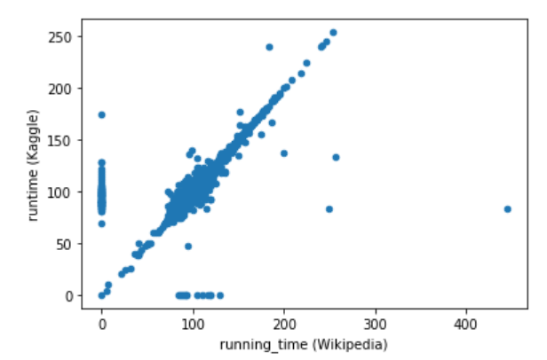
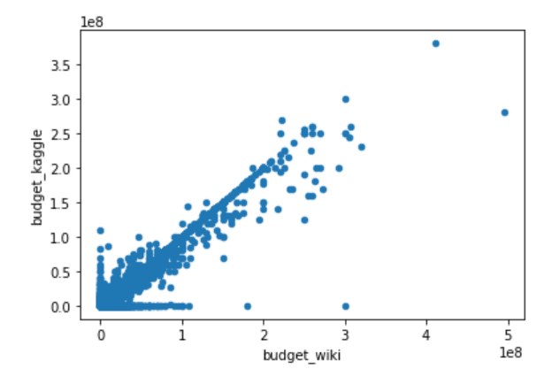
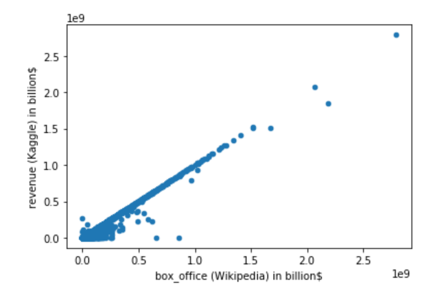
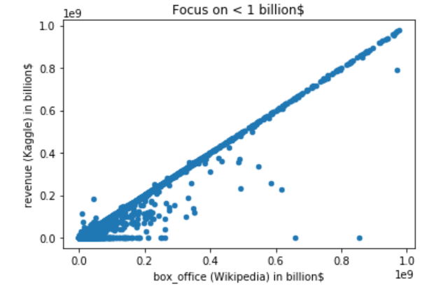
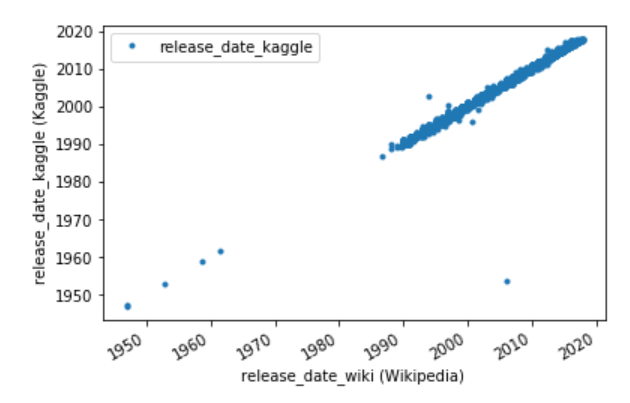

# Movies-ETL

## Challenge

### Objectives
The goals of this challenge are for you to:

- Create an automated ETL pipeline.
- Extract data from multiple sources.
- Clean and transform the data automatically using Pandas and regular expressions.
- Load new data into PostgreSQL.

### Resources

File with code: **challenge.ipynb**

Data: cf. [Data](Data/) folder for Wikipedia dataset and link below for large .csv file (*movies_metadata.csv* for Kaggle dataset and *ratings.csv* for MovieLens dataset).

https://drive.google.com/drive/folders/13f9OHeyWFwbavcMaZG8kKyuSlYLcdUTj?usp=sharing

**NB: in order to run the code, large .csv files must be copied under a Data folder or path to files must be updated in the *challenge.ipynb* file**

### Assumptions took

#### Movie title

Movie title have been taken form Kaggle source as this value was never null in Kaggle dataset.

#### Runtime
Plotting of the same kind of data coming from Wikipedia or Kaggle: if the two columns were exactly the same, we’d see a scatter plot of a perfectly straight line. Any wildly different values will show up as dots far from that central line, and if one column is missing data, those values will fall on the x-axis or y-axis.

Data seem fairly equal between Wikipedia and Kaggle sources.
Based on that, we kept the Kaggle data and complete the missing value with Wikipedia ones.

#### Budget
Same method used for Runtine.

The Wikipedia data appears to have more outliers compared to the Kaggle data. Thus, Kaggle data are missing too. 
Based on the results, we kept the Kaggle data and complete the missing value with Wikipedia ones.

#### Box Office
Same method used for Runtine.

Same as for budget, we kept the Kaggle data and complete the missing value with Wikipedia ones.

#### Release Date
Same method used for Runtine.

We noticed on outlier for Wikipedia data: these have been dropped as Kaggle data have been kept exclusively.

#### Language
In Wikipedia dataset, languages could have been store as a list.
In Kaggle one, each movie has a unique language.
In order to fasten the analysis, we kept only Kaggle data.

#### Production Companies
Wikipedia data seemed less complete than Kaggle one. We kept only Kaggle data.

#### Recap

Here below the recap of resolutions made after taking the assumptions.

|Wikipedia|Kaggle|Resolution|
|---|---|---|
|title_wiki|title_kaggle|Drop Wikipedia.|
|running_time|runtime|Keep Kaggle; fill in zeros with Wikipedia data.|
|budget_wiki|budget_kaggle|Keep Kaggle; fill in zeros with Wikipedia data.|
|box_office|revenue|Keep Kaggle; fill in zeros with Wikipedia data.|
|release_date_wiki|release_date_kaggle|Drop Wikipedia.|
|Language|original_language|Drop Wikipedia.|
|Production companies|production_companies|Drop Wikipedia.|

### Columns loaded in database
#### "movie" table
For each movie, only the values below have been loaded in the table (if they were available):

>['imdb_id','id','title_kaggle','original_title','tagline','belongs_to_collection','url','imdb_link',
'runtime','budget_kaggle','revenue','release_date_kaggle','popularity','vote_average','vote_count',
'genres','original_language','overview','spoken_languages','Country',
'production_companies','production_countries','Distributed by',
'Produced by','Directed by','Starring','Cinematography','Edited by','Written by','Based on']

#### "ratings" table
For each movie, only the values below have been loaded in the table:

>['userId','movieId','rating','timestamp']

